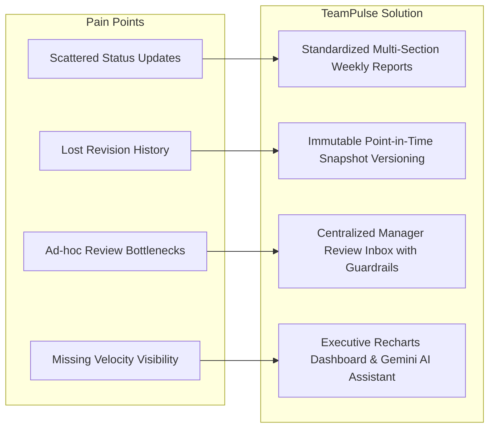
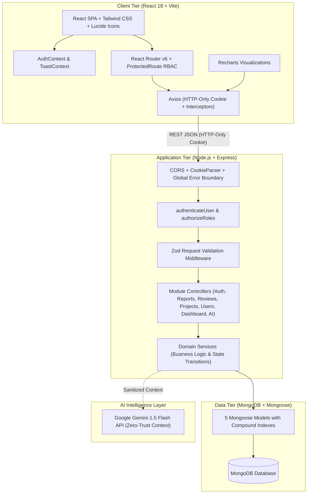
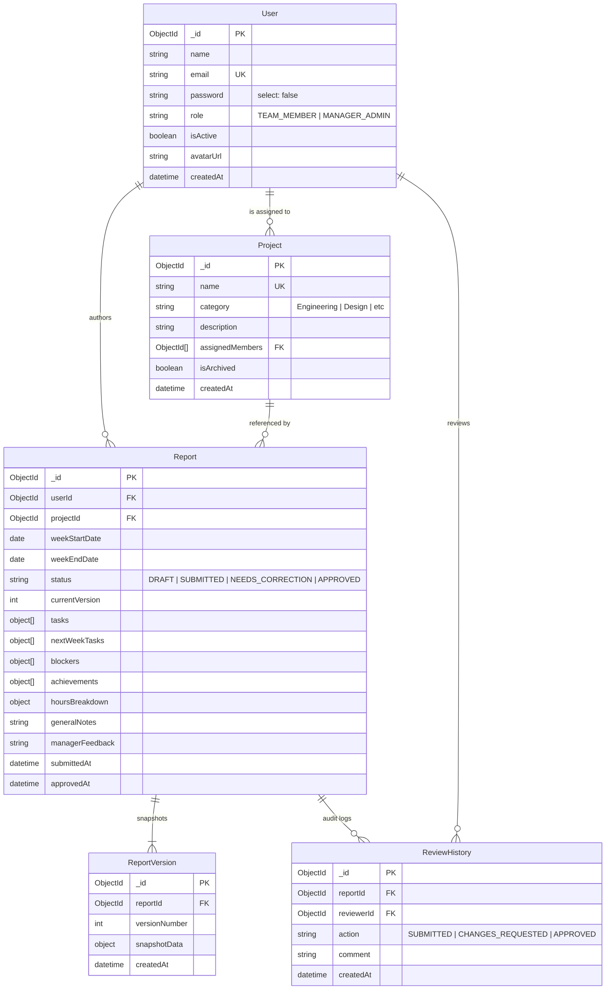
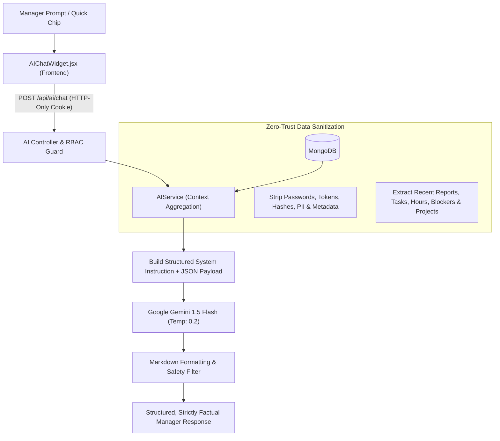
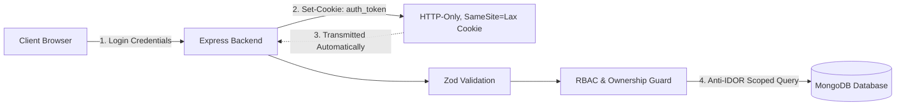

# TeamPulse — Technical Presentation & Slide Deck

This document serves as the comprehensive slide-by-slide technical presentation guide and script for **TeamPulse — Weekly Team Reporting, Performance Dashboard & AI Assistant**, developed for the **Sisenco Digital** technical assignment.

---

## Presentation Overview & Agenda

- **Target Audience**: Technical Assessors, Engineering Leads & Executive Stakeholders
- **Total Presentation Time**: 15–20 minutes (including live system demonstration & Q&A)
- **Key Themes**: Architectural Rigor, Enterprise Security, State-Machine Determinism, Versioned Auditing, and Practical AI Augmentation.

| Slide # | Slide Title | Focus Area | Time |
| :---: | :--- | :--- | :---: |
| **1** | Title & Project Overview | Executive Summary & Deliverable Highlights | 1 min |
| **2** | Problem Statement & Objectives | The Team Reporting Friction & Project Goals | 1.5 min |
| **3** | Solution Architecture & Tech Stack | 3-Tier Layered Design & Technology Choices | 2 min |
| **4** | Dual-Role Access Control (RBAC) | Role Separation & Security Boundaries | 1.5 min |
| **5** | Database Design & Data Modeling | MongoDB Schemas, Relations & Compound Indexing | 1.5 min |
| **6** | Report State Machine Workflow | Deterministic Lifecycle Transitions & Guardrails | 1.5 min |
| **7** | Immutable Version History & Audit Trail | Point-in-Time Snapshots & Chronological Auditing | 1.5 min |
| **8** | Manager Review Inbox & Action Workflows | Review Queue, One-Click Approval & Revisions | 1.5 min |
| **9** | Executive Analytics & Team Management | Real-Time KPIs, Recharts Velocity & Admin Controls | 1.5 min |
| **10** | Google Gemini AI Management Assistant | Zero-Trust Prompt Sanitization & Anti-Hallucination | 2 min |
| **11** | Security, Privacy & Reliability Hardening | HTTP-Only Cookies, Anti-IDOR, Magic-Byte File Checks | 1.5 min |
| **12** | Automated Testing & Quality Verification | 111/111 Integration Tests & Build Verification | 1.5 min |
| **13** | End-to-End Live Demonstration Script | Step-by-Step Flow: Member $\rightarrow$ Manager $\rightarrow$ AI | 3 min |
| **14** | Technical Takeaways, Future Roadmap & Q&A | Summary of Achievements & Interactive Q&A | 2 min |

---

## Slide 1: Title & Project Overview

### Slide Header & Subtitle
- **Title**: **TeamPulse**
- **Subtitle**: Weekly Team Reporting, Performance Dashboard & Gemini AI Management Assistant
- **Organization**: Sisenco Digital Full-Stack Engineering Assignment
- **Presenter**: Full-Stack Engineering Candidate

### Key Highlights
- **Full-Stack MERN Architecture**: React 18 SPA (Vite + Tailwind CSS) + Node.js/Express.js REST API + MongoDB (Mongoose v8).
- **Enterprise-Grade Workflows**: Deterministic report state machine, immutable point-in-time version snapshots (`v1`, `v2`, ...), and complete review audit logs.
- **Strict Dual-Role RBAC**: Zero-trust role separation between `TEAM_MEMBER` and `MANAGER_ADMIN`.
- **Integrated AI Intelligence**: Conversational team analytics and weekly briefing summaries powered by Google Gemini 1.5 Flash.
- **Production-Ready Assurance**: 111 / 111 automated integration tests passing across 8 test suites; zero-error clean production build.

### Speaker Talking Points
> *"Good morning / afternoon. Today, I am excited to present TeamPulse — a complete, production-ready enterprise application designed to solve the challenges of team weekly progress tracking, asynchronous manager review workflows, executive velocity visibility, and intelligent AI-driven performance synthesis. Built entirely with the MERN stack and validated with 111 automated tests, TeamPulse demonstrates clean modular architecture, state-machine rigor, immutable auditing, and high-standard security engineering."*

---

## Slide 2: Problem Statement & Objectives

### The Team Reporting Challenge
- **Fragmented Communication**: Weekly updates scattered across email threads, Slack messages, and ad-hoc meetings lead to missed blockers and lost context.
- **Zero Auditability & Version Drift**: When deliverables change or reports are revised, previous commitments and original submission details are lost.
- **Management Bottleneck**: Managers lack a centralized review queue to approve reports or provide structured, actionable revision feedback.
- **Opaque Velocity & Hours**: Lack of aggregated visibility into cross-project hours, blocker bottlenecks, and team velocity trends.

### Project Objectives & Solution Mapping


### Speaker Talking Points
> *"In typical engineering and digital agency teams, status reporting is notoriously fragmented. Team members write unstructured messages, revisions erase original submissions, and managers spend hours manually chasing updates. TeamPulse replaces this chaotic process with a single source of truth: structured report forms, an immutable snapshotting engine, a formal review state machine, and real-time executive dashboards."*

---

## Slide 3: Solution Architecture & Tech Stack

### 3-Tier Layered Architecture


### Technology Matrix
- **Frontend**: React 18, Vite, Tailwind CSS, Lucide React, Recharts, React Hook Form, Zod (`@hookform/resolvers`), Axios.
- **Backend**: Node.js, Express.js, Mongoose v8, JSON Web Tokens (`jsonwebtoken`), `cookie-parser`, `bcryptjs`, Zod.
- **AI Intelligence**: Google Generative AI SDK (`@google/generative-ai` / Gemini 1.5 Flash).
- **Testing**: Jest, Supertest, In-Memory Mongo / Isolated Test Database.

### Speaker Talking Points
> *"Our architecture strictly enforces separation of concerns across 3 distinct tiers. On the frontend, React 18 and Vite deliver sub-second hot reloading and responsive UI rendering, backed by Tailwind CSS and Recharts. The backend utilizes a modular Controller-Service-Model architecture with Zod validation guards. Communications are authenticated via stateless JWTs transmitted over secure, HTTP-only SameSite cookies."*

---

## Slide 4: Dual-Role Access Control (RBAC)

### Strict Dual-Role Permission Matrix
The system enforces strict dual-role access control. Arbitrary elevation and generic administrative fallbacks are explicitly rejected:

| Feature / Resource | `TEAM_MEMBER` | `MANAGER_ADMIN` | Enforcement Guard |
| :--- | :---: | :---: | :--- |
| **Create & Edit Own Drafts** | ✅ | ❌ *(Reviews only)* | `authorizeRoles('TEAM_MEMBER')` |
| **Submit Weekly Reports** | ✅ | ❌ | State validation + Version Snapshot trigger |
| **View Own Reports & Snapshots** | ✅ | ✅ | Ownership check (`userId === req.user._id`) |
| **View All Team Reports** | ❌ *(Protected)* | ✅ | Anti-IDOR Server-Side Query Filter |
| **Approve Submitted Reports** | ❌ | ✅ | `authorizeRoles('MANAGER_ADMIN')` |
| **Request Report Corrections** | ❌ | ✅ *(Mandatory feedback)*| Zod Schema + State Transition Guard |
| **Access Executive Dashboard & Trends** | ❌ | ✅ | Route & Controller RBAC Guards |
| **Use Gemini AI Chat Assistant** | ❌ *(Hidden & Blocked)* | ✅ | Backend Role Guard + Prompt Sanitization |
| **Create, Edit & Archive Projects** | ❌ | ✅ | `authorizeRoles('MANAGER_ADMIN')` |
| **Assign Members to Projects** | ❌ | ✅ | `authorizeRoles('MANAGER_ADMIN')` |
| **Manage Team Directory & Status** | ❌ | ✅ *(Self-guard)* | Self-Deactivation Protection Logic |
| **Profile & Avatar Management** | ✅ | ✅ | `authenticateUser` |

### Speaker Talking Points
> *"Security begins with identity and authorization boundaries. TeamPulse enforces two distinct roles: TEAM_MEMBER and MANAGER_ADMIN. Team members focus purely on crafting, refining, and submitting weekly reports and viewing their project allocations. Managers have exclusive access to review queues, executive dashboards, project assignments, user directory status toggles, and the Gemini AI assistant. Team members are prevented from accessing manager routes by both client-side route guards and server-side authorization middleware."*

---

## Slide 5: Database Design & Data Modeling

### Entity Relationship Diagram (ERD)


### Strategic Compound Indexing
- **`Report`**: Compound index `{ userId: 1, weekStartDate: -1 }` (optimizes member dashboard queries) and `{ status: 1, weekStartDate: -1 }` (optimizes manager review inbox).
- **`ReportVersion`**: Unique compound index `{ reportId: 1, versionNumber: 1 }` (guarantees zero duplicate version snapshots).
- **`ReviewHistory`**: Compound index `{ reportId: 1, createdAt: 1 }` (enables chronological audit retrieval).

### Speaker Talking Points
> *"Our data tier utilizes 5 normalized Mongoose collections. We balance normalization with performance: high-frequency report items like tasks, blockers, and hours breakdown are stored as embedded subdocuments to ensure fast atomic reads and writes. Point-in-time versioning is achieved via a dedicated ReportVersion collection, while every review interaction is permanently logged in ReviewHistory. Compound indexing ensures our queries scale efficiently as data volume grows."*

---

## Slide 6: Report State Machine Workflow

### Deterministic State Transitions
```
+-----------------------------------------------------------------------------+
|                          REPORT LIFECYCLE                                   |
+-----------------------------------------------------------------------------+

                     [ 1. CREATE DRAFT ]
                              │
                              ▼
                        ┌───────────┐
                        │   DRAFT   │ ◄─────────────────────────┐
                        └─────┬─────┘                           │
                              │ (Submit Report)                 │
                              ▼                                 │
                     [ Snapshot Version v1 ]                    │ (Author Revises)
                              │                                 │
                              ▼                                 │
                        ┌───────────┐                           │
                        │ SUBMITTED │                           │
                        └─────┬─────┘                           │
                              │                                 │
              ┌───────────────┴───────────────┐                 │
              │ (Manager Review)              │ (Request Changes│
              ▼                               ▼  with Feedback) │
        ┌───────────┐             ┌───────────────────┐         │
        │ APPROVED  │             │ NEEDS_CORRECTION  │ ────────┘
        └───────────┘             └───────────────────┘
     (Finalized & Locked)         (Feedback Visible to Author)
```

### State Machine Rules & Constraints
1. **`DRAFT`**: Report is privately editable and deletable by the author. No manager review actions permitted.
2. **`SUBMITTED`**: Triggers immutable snapshot generation (`v1`), locks member edits, and routes the report to the Manager Review Queue.
3. **`NEEDS_CORRECTION`**: Triggered by manager review with mandatory feedback comments. Unlocks editing for the author. Resubmitting increments the version snapshot (`v2`, `v3`).
4. **`APPROVED`**: Terminal state. Locks report against any further modification or deletion across all roles.

### Speaker Talking Points
> *"To ensure absolute operational consistency, we model report progression as a strict finite state machine. Invalid transitions—such as approving a draft directly or attempting to edit an approved report—are rejected at both the service layer and database schema level. When a report is returned for corrections, the author receives clear manager feedback, makes adjustments, and resubmits, creating a clean version increment."*

---

## Slide 7: Immutable Version History & Audit Trail

### Point-in-Time Snapshot Mechanism
- **Deep Document Cloning**: Upon every report submission (`PATCH /api/reports/:id/submit`), the backend creates an immutable `ReportVersion` record storing a full snapshot of tasks, hours, blockers, and deliverables.
- **Zero In-Place Mutation**: Historical snapshots can never be altered or overwritten, providing a tamper-proof audit trail for regulatory and executive review.
- **Snapshot Viewer Modal**: The frontend features an interactive modal allowing managers and members to inspect previous iterations (`v1`, `v2`, etc.) and trace changes.

```
Report Submission Timeline:
[Mon 09:00] Draft Created by Member
[Mon 17:30] Submitted ──────► [ Snapshot v1 Created ] ──► Status: SUBMITTED
[Tue 10:15] Manager Review ──► Feedback: "Add deliverables for API task" ──► Status: NEEDS_CORRECTION
[Tue 14:00] Resubmitted ────► [ Snapshot v2 Created ] ──► Status: SUBMITTED
[Tue 15:30] Manager Review ──► Approved ────────────────► Status: APPROVED
```

### Review Audit Logging (`ReviewHistory`)
Every transition logs:
- **Timestamp** (ISO 8601)
- **Reviewer ID & Name**
- **Action Taken** (`SUBMITTED`, `CHANGES_REQUESTED`, `APPROVED`)
- **Review Comments / Feedback**

### Speaker Talking Points
> *"A key innovation of TeamPulse is its immutable point-in-time versioning system. In typical apps, editing a report overwrites previous data. In TeamPulse, every submission creates a permanent snapshot record. If a manager requests revisions, the original submission remains completely intact in version history, allowing both parties to verify what was originally proposed versus what was subsequently revised."*

---

## Slide 8: Manager Review Inbox & Action Workflows

### Streamlined Review Interface
- **Centralized Pending Queue**: Dedicated `/reviews` inbox listing all submitted reports across all projects.
- **Comprehensive Report View**: Read-only breakdown of planned vs. actual task progress, spent hours, deliverables, blockers, and achievements.
- **One-Click Approval**: Immediate status transition to `APPROVED` with audit log recording.
- **Mandatory Feedback Correction Modal**: Form validation requiring managers to write constructive feedback before returning a report to `NEEDS_CORRECTION`.

```
Manager Action Flow:
[ Review Inbox ] ──► [ Open Report Detail ] ──► [ Inspect Tasks & Hours ]
                                                        │
                      ┌─────────────────────────────────┴─────────────────────────────────┐
                      ▼                                                                   ▼
           [ One-Click Approve ]                                              [ Request Corrections ]
                      │                                                                   │
           - Status: APPROVED                                                 - Enforce Mandatory Feedback
           - Append ReviewHistory                                             - Status: NEEDS_CORRECTION
           - Lock Report Document                                             - Notify Team Member
```

### Speaker Talking Points
> *"Managers are provided with an optimized review dashboard. From the inbox, they can quickly inspect deliverables, compare planned versus actual hours, and evaluate project blockers. Approving a report takes a single click. If changes are necessary, the modal enforces mandatory commentary so team members receive precise, actionable feedback on what needs rectification."*

---

## Slide 9: Executive Analytics & Team Management

### Real-Time Executive Dashboard
- **Top-Level KPI Strip**: Instant metrics for Total Reports, Pending Reviews, Approved Reports, Needs Correction, Active Projects, and Active Members.
- **Interactive Recharts Visualization**: Stacked weekly submission velocity bar chart displaying report volume and status distributions across past 8 reporting cycles.
- **Member Performance Directory**: Aggregated team metrics including individual submission totals, approval ratios, and last active dates.

```
+------------------------------------------------------------------------------------+
|  [ 42 Total Reports ]   [ 4 Pending Review ]   [ 35 Approved ]   [ 8 Active Members ] |
+------------------------------------------------------------------------------------+
|  WEEKLY SUBMISSION VELOCITY (RECHARTS)                                             |
|  [████] Approved   [░░░░] Submitted   [▓▓▓▓] Needs Correction                      |
|                                                                                    |
|  Week 32: ██████████████░░░░                                                       |
|  Week 33: ████████████████████░░░░▓▓▓▓                                             |
|  Week 34: ████████████████████████░░░░                                             |
+------------------------------------------------------------------------------------+
|  TEAM PERFORMANCE TABLE: Member | Projects | Reports | Approval Rate | Last Active |
+------------------------------------------------------------------------------------+
```

### Administrative Controls
- **Project Repository**: Full project lifecycle with category grouping (`Engineering`, `Design`, `Marketing`, `DevOps`) and dynamic member allocation dialogs.
- **Team Directory & Safeguards**: Member status activation/deactivation with self-deactivation protection preventing managers from locking themselves out.

### Speaker Talking Points
> *"The Executive Dashboard transforms granular weekly submissions into strategic operational visibility. Executives and managers can monitor team velocity trends using dynamic Recharts visualizations, identify bottlenecks before they impact delivery, manage project allocations, and administer team accounts with safety safeguards."*

---

## Slide 10: Google Gemini AI Management Assistant

### Intelligent Team Oversight & Conversational Analytics
- **Provider & Model**: Official Google Gemini API (`gemini-1.5-flash`).
- **Target Persona**: Exclusively available to authorized managers (`MANAGER_ADMIN`).
- **Core Capabilities**:
  - **Natural-Language Q&A**: Ask arbitrary questions regarding team throughput, project progress, blocker patterns, and workload distribution.
  - **One-Click Executive Briefings**: Instant synthesis of weekly achievements, delayed tasks, and high-priority roadblocks.
  - **Workload Balance Analysis**: Highlights potential over-allocations or resource imbalances across active projects.

### Zero-Trust Context Retrieval & Anti-Hallucination Guardrails


### Operational Guardrails
1. **Low Temperature (`0.2`)**: Minimizes hallucination risk and enforces strictly factual outputs.
2. **System Instruction Boundaries**: Explicitly forbids speculating or inventing unrecorded tasks, hours, or members.
3. **Graceful Fallback**: If `GEMINI_API_KEY` is omitted or unconfigured, returns an intuitive instructional response without crashing the server.

### Speaker Talking Points
> *"Rather than manually reading dozens of weekly reports, managers can interact with the Gemini-powered AI Management Assistant. Using a zero-trust context aggregation strategy, the backend extracts active projects and recent weekly reports, sanitizes all sensitive credentials, and feeds structured JSON into Gemini 1.5 Flash at low temperature (0.2). The assistant provides immediate, strictly factual executive summaries and answers complex questions about team blockers and workload balance."*

---

## Slide 11: Security, Privacy & Reliability Hardening

### Enterprise Security Architecture



### Comprehensive Security Controls
1. **Zero Client Token Storage**: JWT authentication tokens reside solely in HTTP-only, `sameSite: 'lax'` cookies. JavaScript code running in the browser cannot read or exfiltrate tokens (mitigating XSS).
2. **Bcrypt Password Security**: Passwords hashed with 10 salt rounds and excluded from Mongoose queries by default (`select: false`).
3. **Anti-IDOR Ownership Isolation**: Server-enforced query filters guarantee that team members can only access and modify their own reports.
4. **Input Sanitization**: Zod validation schemas strictly enforce valid ranges, types, and string bounds on every mutation endpoint.
5. **Magic-Byte Avatar Verification**: Profile uploads undergo buffer magic-byte signature validation to block spoofed file extensions and malicious payloads.
6. **Self-Lockout Safeguards**: Built-in backend and frontend validation prevents administrators from deactivating their own accounts.

### Speaker Talking Points
> *"Security is engineered into every layer of TeamPulse. By storing session tokens exclusively in HTTP-only cookies, we eliminate token theft via client-side script injection. Our APIs enforce strict Anti-IDOR ownership scoping, preventing any user from accessing another member's reports. Furthermore, input payloads are validated with Zod, and uploaded avatars are checked using magic-byte file inspection."*

---

## Slide 12: Automated Testing & Quality Verification

### 111 Passing Integration Tests across 8 Test Suites
The backend features an automated test suite using **Jest** and **Supertest**, verifying all critical workflows against an isolated test database:

```text
 PASS  tests/health.test.js               (Health check & DB connectivity)
 PASS  tests/models.test.js               (Mongoose schemas, unique indexes & defaults)
 PASS  tests/auth.test.js                 (Register, login, cookies, logout, RBAC)
 PASS  tests/profile.test.js              (Profile update, password change & avatars)
 PASS  tests/projects.test.js             (Project CRUD, categories & member assignments)
 PASS  tests/reports_and_reviews.test.js  (State machine, snapshots, reviews & IDOR)
 PASS  tests/users_and_dashboard.test.js  (User management, KPIs, trends & self-guard)
 PASS  tests/ai.test.js                   (Gemini AI chat, prompt guards & RBAC)

Test Suites: 8 passed, 8 total
Tests:       111 passed, 111 total
Snapshots:   0 total
Time:        ~14-16s
```

### Production Build Verification
- Clean `vite build` compilation with zero syntax errors, broken imports, or type conflicts.
- Production bundle compiled cleanly into `frontend/dist/`.

### Speaker Talking Points
> *"Quality is demonstrated through rigorous automated testing. We have written 111 integration tests across 8 comprehensive suites covering health checks, data models, authentication and session cookies, profile management, project workflows, the report state machine, version snapshots, manager reviews, dashboard aggregations, and the Gemini AI assistant. Every test passes reliably, and the frontend compiles to a clean production bundle."*

---

## Slide 13: End-to-End Live Demonstration Script

### Demonstration Walkthrough Checklist

```
+-------------------------------------------------------------------------------------+
| 1. Team Member Flow:                                                                |
|    - Log in as Alex Rivera (alex@example.com)                                       |
|    - Open Create Weekly Report form                                                 |
|    - Select assigned Project, fill tasks, hours, achievements, and blockers         |
|    - Save as DRAFT -> Review draft preview -> Click "Submit Report"                 |
|    - Verify snapshot v1 is created and report status transitions to SUBMITTED       |
+-------------------------------------------------------------------------------------+
| 2. Manager Review & Revision Flow:                                                  |
|    - Log in as Sarah Connor (manager@example.com)                                   |
|    - Open Review Inbox -> Click newly submitted report                              |
|    - Click "Request Corrections" -> Enter feedback comment -> Submit                |
|    - Verify report status transitions to NEEDS_CORRECTION                           |
+-------------------------------------------------------------------------------------+
| 3. Revision & Resubmission:                                                         |
|    - Switch back to Alex Rivera -> View manager feedback alert banner               |
|    - Edit task details -> Click "Resubmit Report"                                   |
|    - Inspect Version History Modal to see snapshot v1 and v2 side-by-side           |
+-------------------------------------------------------------------------------------+
| 4. Manager Approval & Dashboard Analytics:                                          |
|    - Log in as Sarah Connor -> Open Review Inbox -> Click "Approve Report"          |
|    - Navigate to Dashboard -> Observe updated KPI cards and Recharts velocity bar   |
+-------------------------------------------------------------------------------------+
| 5. Gemini AI Assistant:                                                             |
|    - Click floating AI Assistant icon on the Manager Dashboard                      |
|    - Click "Summarize this week's team activity" quick prompt                       |
|    - Ask conversational question: "What are the main blockers across projects?"     |
|    - Review structured, factual markdown insights                                   |
+-------------------------------------------------------------------------------------+
```

### Speaker Talking Points
> *"Now let's walk through a live system demonstration. We will first log in as a team member, create and submit a weekly report, generating snapshot version 1. Next, we log in as the manager, inspect the pending inbox, and request revisions with feedback. The member revises the report, creating version 2 upon resubmission. The manager approves the report, triggering live updates to our dashboard KPIs and velocity charts. Finally, we open the Gemini AI assistant to generate an instant executive summary of the week's progress."*

---

## Slide 14: Technical Takeaways, Future Roadmap & Q&A

### Technical Takeaways & Achievements
- **Full Specification Conformance**: Complete delivery of all Sisenco Digital requirements for weekly reporting, review workflows, versioning, and executive oversight.
- **Engineering Rigor**: Deterministic state machine, immutable snapshotting, dual-role RBAC, and zero-trust AI context retrieval.
- **Robust Quality**: 111/111 passing automated integration tests, clean codebase structure, and complete architectural documentation.

### Future Roadmap Enhancements
1. **Automated Weekly Email/Slack Digests**: Scheduled cron notifications for pending report deadlines.
2. **Export Capabilities**: One-click PDF / Excel export of finalized weekly reports and executive velocity charts.
3. **Multi-Manager Department Routing**: Dynamic routing of reports based on department or team hierarchy.
4. **Historical Trend AI Forecasting**: Predictive velocity forecasting based on multi-quarter reporting metrics.

---

## Slide 15: Q&A & Discussion

### Technical Discussion Points for Interviewers
- **Architecture**: Why MongoDB embedded subdocuments vs. normalized SQL relations for weekly report sub-items?
- **Security**: How HTTP-only cookies protect against token exfiltration compared to localStorage JWT storage.
- **State Integrity**: How schema and service guards prevent race conditions during status transitions.
- **AI Design**: Rationale for low-temperature direct context retrieval over multi-hop vector embeddings for team reporting data.

---

*Thank you for your time and consideration. The system is open for live demonstration and codebase inspection.*
